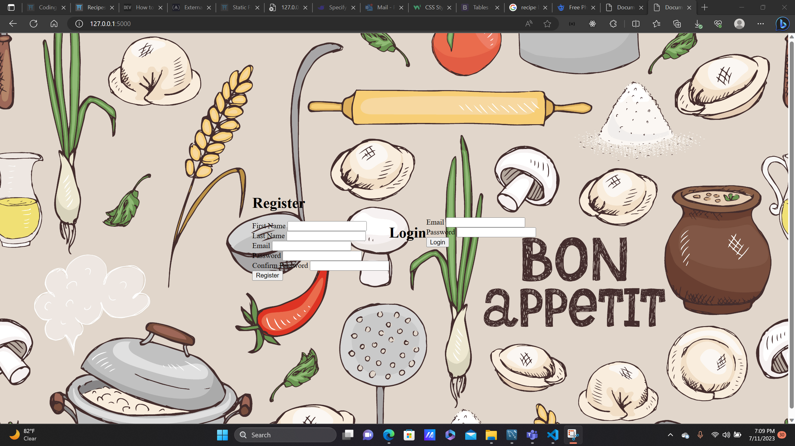
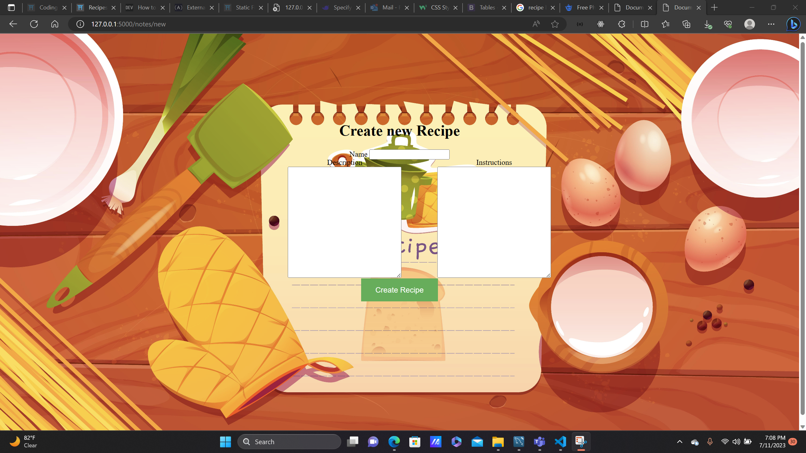

# Recipes

Web application buuilt in Flask micro framework. Allows users to store a list of their recipes and keep them safe in a mysql data base. Users are able to add, edit or delete saved data from the database.


## 🔗 Links
[](https://durand90.github.io/)
[](https://www.linkedin.com/in/fanfan-durand/)


## Login Page




# Landing Page


# Add Recipe Page




## 🛠 Skills
Python, HTML, CSS, Flask, Session, Balsamiq, Trello, MySQL Server


## Tech Stack

**Client:** Python, Sessons

**Server:** MySQL, Bcrypt


## Running Tests

To run tests, run the following command

```bash
  pipenv shell
  python server.py
```

